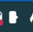
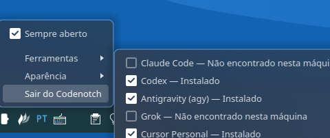

# Codenotch Plasma

<p align="center">
  
</p>

<p align="center">
  <strong>Notch de uso de assistentes de código na borda da tela — port para KDE Plasma no Linux.</strong>
</p>

[](LICENSE)
[](https://github.com/williamccampos/codenotch-plasma/releases)

Port do excelente [codenotch-gnome](https://github.com/RicardoEGG/codenotch-gnome) (por [Ricardo Egg](https://github.com/RicardoEGG)), que por sua vez é port do [codenotch](https://github.com/vinzdg/codenotch) original de [vinzdg](https://github.com/vinzdg).

> **Disclaimer:** esta versão é **exclusiva para Linux com KDE Plasma** (testado em Plasma 5.27 / Ubuntu 24.04).  
> Não é um plasmoid de painel — é um overlay frameless que replica o visual e a experiência do notch original na borda da tela. GNOME, Windows e macOS **não são suportados**.

## Identidade visual

O símbolo do Codenotch é um **notch minimalista** — uma pill com recorte lateral, inspirada no formato do notch físico na borda da tela. Entre quatro propostas iniciais, o design **D · Notch limpo** foi escolhido por ser legível na bandeja do sistema em tamanhos pequenos (16–22 px), sem parecer três anéis ou competir com os ícones das IAs dentro do próprio notch.

| Contexto | Comportamento |
|----------|---------------|
| **Bandeja do sistema** | Ícone **sempre branco** (fixo) |
| **Menu de aplicativos** | Ícone **sempre branco** (fixo) |
| **Notch** | Corpo e logos alternam entre escuro e claro conforme o tema |

Arquivos do ícone: [`icons/codenotch-plasma.svg`](icons/codenotch-plasma.svg) · propostas exploratórias em [`icons/preview/`](icons/preview/)



## Tema

O **notch** suporta três modos, configuráveis de duas formas:

| Modo | Notch | Logos das IAs |
|------|-------|---------------|
| **Automático** | Segue o tema do Plasma | Brancos no escuro, pretos no claro |
| **Escuro** | Corpo preto | Brancos |
| **Claro** | Corpo branco | Pretos |

### Alternar pelo notch

Abaixo da última IA há um botão de tema (anel menor, separado por um traço discreto):

| Ícone | Significado | Ao clicar |
|-------|-------------|-----------|
| ☀️ **Sol** | Notch está escuro | Alterna para **claro** |
| 🌙 **Lua** | Notch está claro | Alterna para **escuro** |

O botão do notch alterna apenas entre **escuro ↔ claro** (sem ciclar o automático). Em modo automático, o ícone mostra sol ou lua conforme o tema aplicado no momento.

No rodapé do notch, o botão **···** abre o mesmo menu da bandeja (Ferramentas, Aparência, Monitor, Sair). O clique direito no notch também abre esse menu.

### Alternar pela bandeja

Clique direito no ícone da bandeja → **Aparência** → escolha **Automático**, **Escuro** ou **Claro**.

## Monitor

Com mais de um display conectado, escolha em qual tela o notch aparece:

- **Clique direito no notch** ou **clique direito no ícone da bandeja** → **Monitor**
- **Tela principal** — segue a tela principal definida nas configurações do KDE (padrão)
- **Lista de monitores** — nomes do sistema + resolução (ex.: `HDMI-A-1 (1920×1080)`)

A escolha é salva em `screen` no `config.json`. Se um monitor fixo for desconectado, o notch volta temporariamente para a tela principal até ele ser reconectado.

| Tema escuro | Tema claro |
|:---:|:---:|
|  |  |

## Instalar

O jeito mais simples é pelo **pacote `.deb`**, publicado automaticamente em cada release do GitHub:

1. Abra a [página de Releases](https://github.com/williamccampos/codenotch-plasma/releases)
2. Baixe `codenotch-plasma_<versão>_amd64.deb` (ex.: `0.3.0`)
3. Instale:

```bash
sudo apt install ./codenotch-plasma_<versão>_amd64.deb
```

O pacote instala o binário em `/usr/bin/codenotch-plasma`, registra **autostart** no login do KDE, instala o ícone no menu de aplicativos e resolve as dependências Python do sistema (`python3-pyqt5`, etc.).

### Limitações conhecidas

> **Claude — somente CLI**  
> O Codenotch **não detecta** login feito no app **Claude Desktop** (`~/.config/Claude`).  
> Para o Claude aparecer no notch, é necessário autenticar pelo **Claude Code CLI** — isso cria `~/.claude/.credentials.json`:
> ```bash
> claude   # faça login no terminal
> ```

> **Antigravity — certificado TLS expirado no pacote 1.x (Linux)**  
> O Antigravity **1.23.x** empacota um certificado localhost que **expirou em 04/09/2026** (`cert.pem` em `/usr/share/antigravity/.../languageServer/`). Sintomas: *Agent execution terminated due to error*, `certificate has expired` nos logs, e o notch sem dados.  
> **Workaround** (app volta a funcionar; só afeta TLS local 127.0.0.1):
> ```bash
> ./scripts/fix-antigravity-tls.sh   # cria launcher com NODE_TLS_REJECT_UNAUTHORIZED=0
> ```
> Depois feche o Antigravity e abra de novo pelo menu. Solução definitiva: migrar para **Antigravity 2.x** quando disponível no APT.  
> Detalhes: [#1 — Validar suporte ao Antigravity IDE no Linux/KDE](https://github.com/williamccampos/codenotch-plasma/issues/1)

## Prévia

| Notch expandido | Card de hover |
|:---:|:---:|
|  |  |

| Recolhido na borda | Anel duplo do Codex |
|:---:|:---:|
|  |  |

## O que é

Um pill colado na borda da tela que desdobra ao passar o mouse, mostrando o uso dos seus assistentes de código em tempo real:

- **Anéis coloridos** por provider — verde (0–49%), amarelo (50–69%), laranja (70–100%)
- **Tema escuro ou claro** — alternância rápida pelo sol/lua no notch ou pelo menu Aparência
- **Card de hover** com limites, horários de reset e sessões ativas
- **Anel duplo no Codex** — externo (5h) + interno (semanal)
- **Refresh automático** quando os limites resetam
- **Autostart** no login do KDE

Codenotch **nunca faz login**. Ele só lê credenciais que já existem na sua máquina.

## Instalação manual (desenvolvimento)

```bash
git clone https://github.com/williamccampos/codenotch-plasma.git
cd codenotch-plasma
./install.sh
```

**Requisitos:** Linux · KDE Plasma · Python 3.10+ · PyQt5

```bash
sudo apt install python3-pyqt5   # Ubuntu / Debian
sudo apt install libsecret-tools # opcional — Antigravity IDE: ler credenciais do keyring
```

O script instala em `~/.local/bin/codenotch-plasma`, registra autostart e inicia o notch na borda direita.

### Build local do `.deb`

```bash
./scripts/build-deb.sh          # usa VERSION do repositório
./scripts/build-deb.sh 0.1.1    # versão explícita
sudo apt install ./dist/codenotch-plasma_0.1.1_amd64.deb
```

**Uso:** passe o mouse na borda → notch desdobra. Clique esquerdo em um anel abre o dashboard do provider. Clique direito no notch ou na bandeja abre o menu completo.

### Menu da bandeja

O menu da bandeja (também acessível pelo **···** no rodapé do notch ou clique direito no notch) contém:

| Item | Função |
|------|--------|
| **Sempre aberto** | Mantém o notch desdobrado |
| **Ferramentas** | Liga/desliga cada IA no notch |
| **Aparência** | Automático, Escuro ou Claro |
| **Monitor** | Tela principal ou monitor específico |
| **Sair do Codenotch** | Encerra o aplicativo |

### Ferramentas

No ícone da bandeja do sistema, **Ferramentas** lista todas as IAs com um interruptor para cada uma — igual às preferências do codenotch-gnome:

| Status no menu | Significado |
|----------------|-------------|
| **Instalado** | Credenciais detectadas na máquina — pode aparecer no notch |
| **Não encontrado nesta máquina** | Ferramenta ainda não instalada ou sem login — não entra no notch |

**Regras (como no original):**

- Só entram no notch IAs **instaladas** e **habilitadas** no menu
- Ao habilitar uma IA nova, ela aparece **no final** do notch; ao desabilitar, o notch encolhe
- A ordem é salva em `providerOrder` no `config.json`



## Providers suportados

| Provider | Onde lê a credencial |
|----------|----------------------|
| Claude Code (**CLI** — Desktop **não** suportado) | `~/.claude/.credentials.json` |
| Codex | `~/.codex/auth.json` |
| Cursor Personal | sessão do Cursor IDE / agent |
| Cursor Corp | login no browser (Edge) + [`browser-cookie3`](requirements.txt) |
| Antigravity (IDE ou `agy`) — **instável no Linux** | keyring (`gemini` / `antigravity`) ou `~/.gemini/antigravity` · ver [issue #1](https://github.com/williamccampos/codenotch-plasma/issues/1) |
| Grok | `~/.grok/auth.json` |
| Kiro | `~/.local/share/kiro-cli/data.sqlite3` |

Se nenhum provider estiver disponível, anéis de demonstração são exibidos para você avaliar o visual.

### Logos

Marcas oficiais com variantes clara/escura para Cursor, Kiro, Claude, Grok, Antigravity e OpenAI/Codex (fonte: [vinzdg/codenotch](https://github.com/vinzdg/codenotch) / [Lobe Icons](https://github.com/lobehub/lobe-icons), MIT). Detalhes em [`src/codenotch_plasma/assets/NOTICE.md`](src/codenotch_plasma/assets/NOTICE.md).

### Codex — anel duplo

| Anel | Limite | Comportamento |
|------|--------|---------------|
| Externo (grosso) | 5 horas | Esgotado → laranja |
| Interno (fino) | Semanal | Quota principal → label abaixo do anel |
| Logo | — | Permanece aceso enquanto o limite **semanal** não estiver em 100% |

## Configuração

Arquivo: `~/.config/codenotch-plasma/config.json` — veja [`config.example.json`](config.example.json).

| Chave | Padrão | Descrição |
|-------|--------|-----------|
| `edge` | `right` | Borda: `left`, `right`, `top`, `bottom` |
| `position` | `0.5` | Posição na borda (0–1) |
| `alwaysOpen` | `false` | Manter notch desdobrado |
| `hideInFullscreen` | `true` | Esconder em tela cheia |
| `scale` | `1.0` | Escala do notch |
| `textScale` | `1.0` | Escala do texto |
| `openDelay` | `150` | Delay para abrir (ms) |
| `refreshInterval` | `60` | Intervalo de refresh (s) |
| `color` | `#000000` | Cor do corpo (sobrescrita pelo `themeMode`) |
| `opacity` | `1.0` | Opacidade do corpo |
| `themeMode` | `auto` | Tema do notch: `auto`, `dark` ou `light` |
| `screen` | `primary` | Tela do notch: `primary` ou nome do monitor (ex.: `HDMI-A-1`) |
| `disabledProviders` | `[]` | IDs de providers desabilitados |
| `providerOrder` | `[]` | Ordem dos anéis no notch (novos entram no final) |

**Logs e cache:** `/tmp/codenotch-plasma.log` · `~/.cache/codenotch/readings.json`

## Desinstalar

**Pacote `.deb`:**

```bash
sudo apt remove codenotch-plasma
```

**Instalação manual:**

```bash
./uninstall.sh
```

Config e cache do usuário são preservados em ambos os casos.

## Privacidade

Codenotch lê credenciais **apenas localmente** e nunca as envia para servidores de terceiros além das APIs oficiais de cada provider. Nenhum dado é coletado pelo próprio Codenotch.

## Créditos

- Design, geometria, paleta e glyphs: [vinzdg/codenotch](https://github.com/vinzdg/codenotch)
- Port GNOME: [RicardoEGG/codenotch-gnome](https://github.com/RicardoEGG/codenotch-gnome)
- Port KDE Plasma: [williamccampos/codenotch-plasma](https://github.com/williamccampos/codenotch-plasma)
- Logos Claude / Grok / Antigravity / OpenAI: [Lobe Icons](https://github.com/lobehub/lobe-icons) (MIT), via codenotch
- Ícones sol/lua do toggle de tema: [Lucide](https://github.com/lucide-icons/lucide) (ISC)

## Licença

[MIT](LICENSE)
