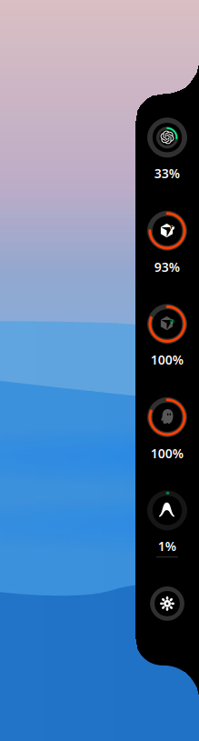
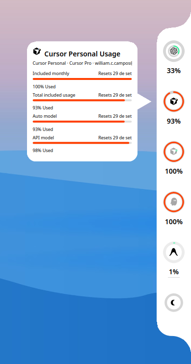
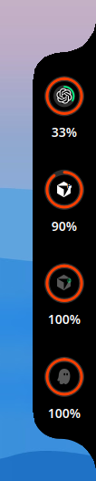

# Codenotch Plasma

Notch de uso de assistentes de código na borda da tela — port para **KDE Plasma no Linux**.

Port do excelente [codenotch-gnome](https://github.com/RicardoEGG/codenotch-gnome) (por [Ricardo Egg](https://github.com/RicardoEGG)), que por sua vez é port do [codenotch](https://github.com/vinzdg/codenotch) original de [vinzdg](https://github.com/vinzdg).

> **Disclaimer:** esta versão é **exclusiva para Linux com KDE Plasma** (testado em Plasma 5.27 / Ubuntu 24.04).  
> Não é um plasmoid de painel — é um overlay frameless que replica o visual e a experiência do notch original na borda da tela. GNOME, Windows e macOS não são suportados.

## Prévia

<!-- Adicione seus prints em docs/screenshots/ e descomente as linhas abaixo -->

<!--  -->
<!--  -->
<!--  -->
<!--  -->

## O que é

Um pill preto colado na borda da tela que desdobra ao passar o mouse, mostrando:

- **Anéis coloridos** por provider (verde → amarelo → laranja conforme o uso)
- **Card de hover** com limites, resets e sessões ativas
- **Anel duplo no Codex** — externo (5h) + interno (semanal)
- **Refresh automático** nos resets de quota
- **Autostart** no login do KDE

## Requisitos

| Item | Versão / nota |
|------|----------------|
| SO | Linux |
| Desktop | **KDE Plasma** (Wayland ou X11) |
| Python | 3.10+ |
| PyQt5 | `sudo apt install python3-pyqt5` |
| Opcional | `browser-cookie3` — sessão corporativa do Cursor no browser |

## Instalação

```bash
git clone https://github.com/williamccampos/codenotch-plasma.git
cd codenotch-plasma
./install.sh
```

O script instala em `~/.local/bin/codenotch-plasma`, registra autostart em `~/.config/autostart/` e inicia o notch na borda direita.

Clique direito no notch: **Sempre aberto** ou **Sair**.

## Providers

Codenotch **nunca faz login**. Um provider só aparece quando já existe credencial local.

| Provider | Credencial local |
|----------|------------------|
| Claude Code | `~/.claude/.credentials.json` |
| Codex | `~/.codex/auth.json` |
| Cursor Personal | sessão do Cursor IDE / agent |
| Cursor Corp | login no browser (Edge) + `browser-cookie3` |
| Grok | `~/.grok/auth.json` |
| Kiro | `~/.local/share/kiro-cli/data.sqlite3` |

Se nenhum provider estiver disponível, anéis de demonstração são exibidos para você avaliar o visual.

### Codex — anel duplo

- **Anel externo (grosso):** limite de 5 horas
- **Anel interno (fino):** limite semanal
- **Label:** % do limite semanal (quota principal)
- **Logo:** permanece aceso enquanto o limite semanal não estiver em 100%

## Configuração

Arquivo: `~/.config/codenotch-plasma/config.json`

Exemplo em [`config.example.json`](config.example.json).

| Chave | Padrão | Descrição |
|-------|--------|-----------|
| `edge` | `right` | Borda: `left`, `right`, `top`, `bottom` |
| `position` | `0.5` | Posição na borda (0–1) |
| `alwaysOpen` | `false` | Manter notch desdobrado |
| `hideInFullscreen` | `true` | Esconder em tela cheia |
| `scale` | `1.0` | Escala do notch |
| `textScale` | `1.0` | Escala do texto |
| `openDelay` | `150` | Delay para abrir (ms) |
| `refreshInterval` | `60` | Intervalo de refresh (s) |
| `color` | `#000000` | Cor do corpo |
| `opacity` | `1.0` | Opacidade do corpo |
| `disabledProviders` | `[]` | IDs de providers desabilitados |

Cache de leituras: `~/.cache/codenotch/readings.json`  
Log: `/tmp/codenotch-plasma.log`

## Desinstalar

```bash
./uninstall.sh
```

## Créditos

- Design, geometria, paleta e glyphs: [vinzdg/codenotch](https://github.com/vinzdg/codenotch)
- Port GNOME: [RicardoEGG/codenotch-gnome](https://github.com/RicardoEGG/codenotch-gnome)
- Port KDE Plasma: este repositório

## Licença

[MIT](LICENSE)
